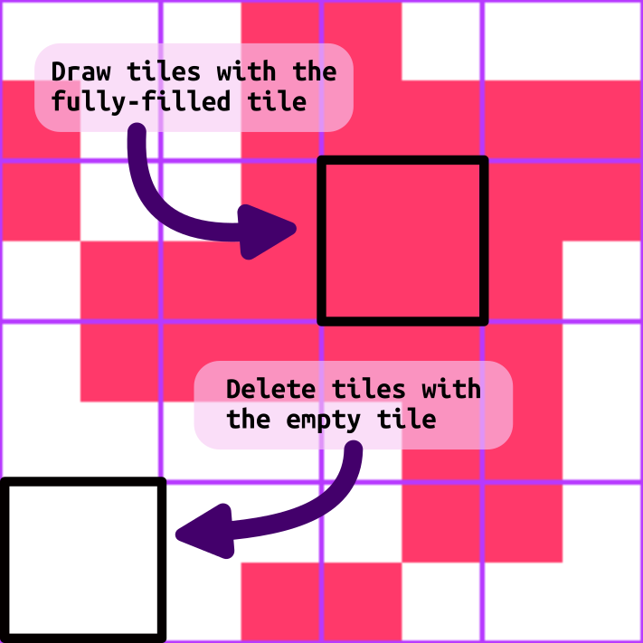

# TileMapDual Godot Node

Introducing TileMapDual, a custom TileMapLayer node
which provides a real-time, in-editor and in-game dual-grid tileset system for Godot.
This dual-grid system [proposed by Oskar Stålberg](https://x.com/OskSta/status/1448248658865049605) reduces the number of tiles required from 47 to just 15 (yes, fifteen!!), rocketing your dev journey!  

## Advatages

Using a dual-grid system has the following advantages:  
- Only 15 tiles are required, instead of 47
- The tiles can have perfectly rounded corners
- The tiles align to the world grid

## Installation and usage

Just copy the `TileMapDual.gd` script (Inside the TileMapDual folder) to your project to start using the new custom node.  

You have to create a regular `TileMapLayer` with your own 2x2 tileset, following the [standard godot tileset](https://user-images.githubusercontent.com/47016402/87044518-ee28fa80-c1f6-11ea-86f5-de53e86fcbb6.png).
You just need to quickly sketch your level with the fully filled tile, indicated here:

Then, create a `TileMapDual` node and assign the `TileMapLayer` to it. Just click the `Update in Editor` checkbox, and the dual grid will be automatically configured and generated in real-time.  
Any change in the `TileMapLayer` will be updated by simply clicking the checkbox again!

An in-game implementation can be activated by ckecking the `Update in Game` setting. This will update the dual grid in real-time during gameplay, thanks to the `TileMapLayer.changed` signal.

## Why?

Previous implementations of a dual-grid tileset system in Godot
by [GlitchedInOrbit](https://github.com/GlitchedinOrbit/dual-grid-tilemap-system-godot-gdscript)
and [jess:codes](https://github.com/jess-hammer/dual-grid-tilemap-system-godot)
used an inverted version of the official 16-tile template (although Jess's tileset is provided as an example in this repo).
This is a potential source of headaches, and this release corrects said inversion.  

This release also implements modern TileMapLayers instead of the deprecated TileMap node.  

Finally, and most importantly, this release simplifies the process by introducing the dual-grid system as a simple custom node that runs within the editor, making it easy to integrate into your own projects.  

## To-do

- Implement isometric support

## References

- [Dual grid Twitter post by Oskar Stålberg](https://x.com/OskSta/status/1448248658865049605)
- ['Programming Terrain Generation' video by ThinMatrix](https://www.youtube.com/watch?v=buKQjkad2I0)
- ['Drawing Fewer Tiles' video by jess:codes](https://www.youtube.com/watch?v=jEWFSv3ivTg)
- [jess:codes implementation in C#](https://github.com/jess-hammer/dual-grid-tilemap-system-godot)
- [GlitchedInOrbit implementation in GDScript](https://github.com/GlitchedinOrbit/dual-grid-tilemap-system-godot-gdscript)

## Feedback

Please feel free to contact me to provide feedback, suggestions, or improvements to this project.  
- [Twitter (@GilaPixel)](https://x.com/gilapixel)
- [Instagram (@GilaPixel)](https://www.instagram.com/gilapixel/)
- [Reddit (/u/pgilah)](https://www.reddit.com/u/pgilah/)
